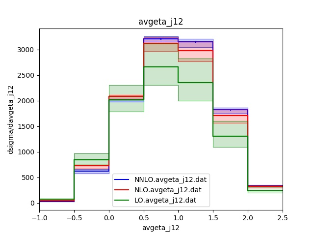
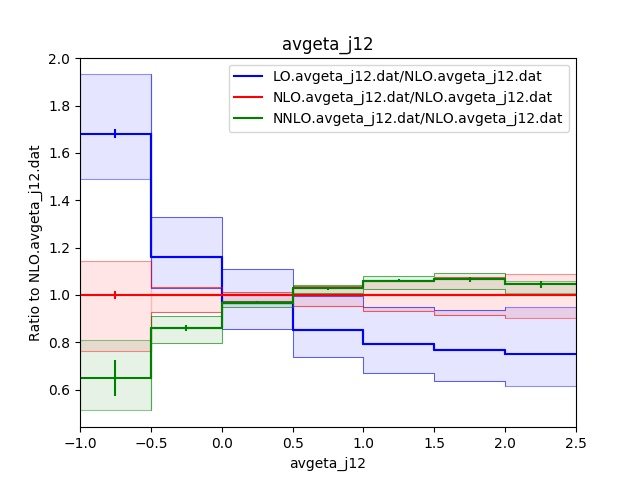
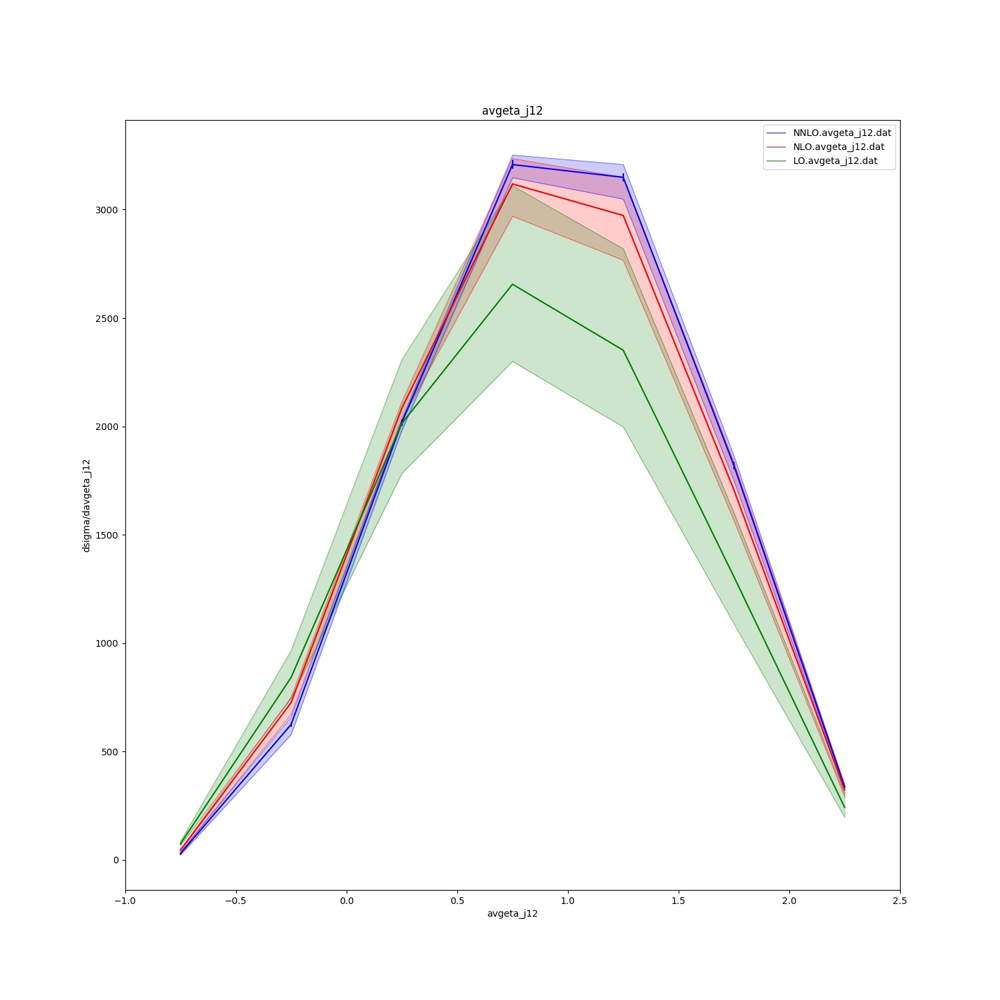
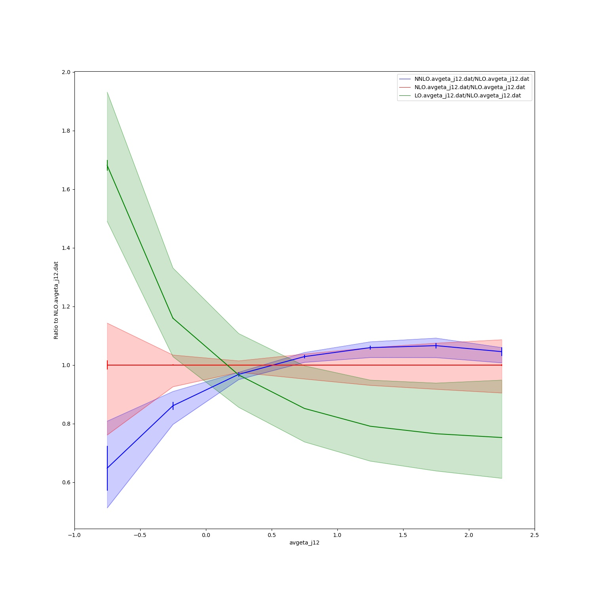

# README
nnlojet-plot is a set of plotting routines for data files from the HEP Monte-Carlo program NNLOJET, designed to use matplotlib, numpy and pandas. 

These are work in progress, essentially rewriting local scripts of mine. I plan to add simple chi squared functionality as and when I have time. To get started should be simple, just run

```python3 nnlojet_plot.py [data files] <extra options>```

for your plots. For more information, run

```python3 nnlojet_plot.py --help```

These are not necessarily designed as publication quality plots, rather a quick way to visualise what is happening in the data. 

For ratio plots, stat errors are combined as usual 
```a/b*sqrt((err_a/a)**2+(err_b/b)**2)```
and the ratio scale errors are simply the numerator scale errors normalised to the central scale of the denominator

## Examples:
Some example plots using dijet production in positron-proton charged current DIS data from [this paper](https://arxiv.org/abs/1807.02529):

Example plot for the Histogram plot mode:

Example ratio plot for the Histogram plot mode (ratio to NLO):

Example plot for the Line plot mode:

Example ratio plot for the Line plot mode (ratio to NLO):

