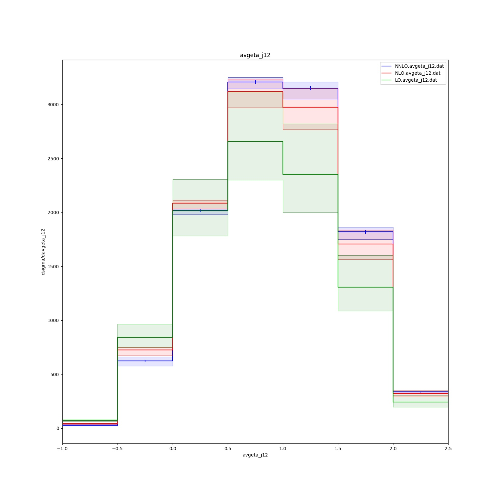

# README
nnlojet-plot is a set of plotting routines for data files from the HEP Monte-Carlo program NNLOJET, designed to use matplotlib, numpy and pandas. 

These are work in progress, essentially rewriting local scripts of mine. I plan to add simple ratio and chi squared functionality as and when I have time. To get started should be simple, just run
```python3 nnlojet_plot.py [data files] <extra options>```
for your plots. For more information, run
```python3 nnlojet_plot.py --help```
This are not necessarily designed as publication quality plots, rather a quick way to visualise what is happening in the data. 


## Examples:
Some example plots using dijet production in positron-proton charged current DIS data from [this paper](https://arxiv.org/abs/1807.02529).
Example plot for the Histogram plot mode:

Example plot for the Line plot mode:
